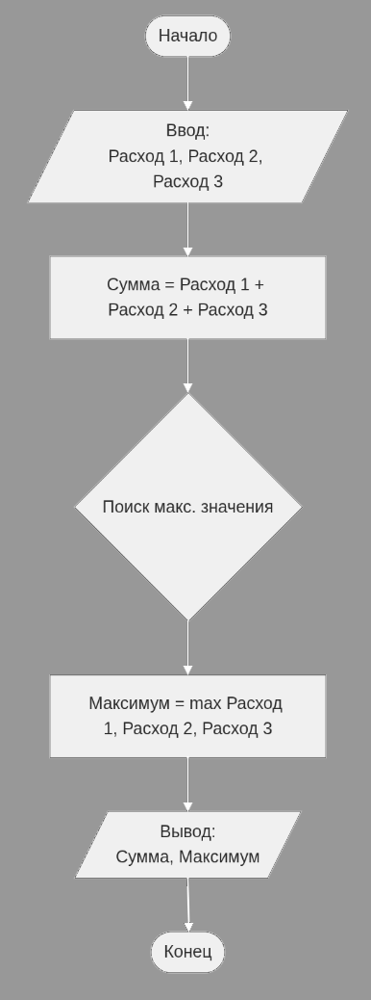

# **Отчёт по лабораторным работам R**

## Сведения о студенте  
**Дата:** 09-02-2026  
**Семестр:** 2 курс 1 полугодие – 3 семестр  
**Группа:** ПИН-б-о-24-1 (2)  
**Дисциплина:** Технологии программирования  
**Студент:** Кара Артем Валерьевич 

---

## **Лабораторная работа №1**

### **Цель**  
Познакомиться с особенностями процедурного программирования. Решить задания в процедурном стиле. Составить отчёт.

### **Теоретическая часть**  
Изучены основы процедурного программирования, базовые понятия: переменная, функция, процедура.

### **Практическая часть**

#### **Задание 1**  
**Текст задачи:** Написать программу, выполняющуюся в процедурном стиле. Программа должна рассчитывать сумму расходов за месяц. На вход запрашиваются сведения о расходах по нескольким пунктам (минимум 3 статьи). На выходе указываются суммарные расходы и максимальная статья расходов.  

**Псевдокод:**  
```R
НАЧАЛО
  Переменная Расходы_1, Расходы_2, Расходы_3
  Переменная Сумма, Максимум

  ВЫВЕСТИ "Введите сумму расходов за Аренду:"
  СЧИТАТЬ Расходы_1
  ВЫВЕСТИ "Введите сумму расходов за Еду:"
  СЧИТАТЬ Расходы_2
  ВЫВЕСТИ "Введите сумму расходов за Транспорт:"
  СЧИТАТЬ Расходы_3

  Максимум <- НАЙТИ_МАКСИМУМ(Расходы_1, Расходы_2, Расходы_3)
  Сумма <- Расходы_1 + Расходы_2 + Расходы_3
  
  ВЫВЕСТИ "Общая сумма расходов: " + Сумма
  ВЫВЕСТИ "Максимальная статья расходов: " + Максимум
КОНЕЦ
```

**Блок-схема:**  


**Фрагмент кода на R:**  
```R
calculate_payments <- function() {
  if (interactive()) {
    cat("Введите расходы на Продукты: ")
    cost1 <- as.numeric(readline())
    cat("Введите расходы на Коммунальные услуги: ")
    cost2 <- as.numeric(readline())
    cat("Введите расходы на Транспорт: ")
    cost3 <- as.numeric(readline())
  } else {
    cost1 <- 12500
    cost2 <- 6000
    cost3 <- 2000
  }
  
  if (is.na(cost1) || is.na(cost2) || is.na(cost3)) {
    cat("Ошибка: Введены некорректные данные.\n")
    return(NULL)
  }
  
  max_payment <- max(cost1, cost2, cost3)
  total_sum <- cost1 + cost2 + cost3
  
  payment_names <- c("Продукты", "Коммунальные услуги", "Транспорт")
  payment_values <- c(cost1, cost2, cost3)
  max_category <- payment_names[which.max(payment_values)]
  
  cat("Отчёт о расходах\n")
  cat(sprintf("Суммарные расходы за месяц: %.2f\n", total_sum))
  cat(sprintf("Максимальная статья расходов: %.2f (%s)\n", max_payment, max_category))
}

calculate_payments()
```

**Пример работы программы:**  
```
Введите расходы на Продукты: 15000
Введите расходы на Коммунальные услуги: 5500
Введите расходы на Транспорт: 3200

--- Отчёт о расходах ---
Суммарные расходы за месяц: 23700.00
Максимальная статья расходов: 15000.00 (Продукты)
```

#### **Задание 2**  
**Текст задачи:** Опишите представленный код в виде псевдокода и ответьте, что будет получено при передаче функции числа 7? Реализуйте алгоритм на R.

**Псевдокод:**  
```R
ФУНКЦИЯ foo(число n)
    ЕСЛИ n > 0 ТО
        Результат_рекурсии <- ВЫЗОВ foo(n - 1)
        ВОЗВРАТ (n * Результат_рекурсии)
    ИНАЧЕ
        ВОЗВРАТ 1
    КОНЕЦ ЕСЛИ
КОНЕЦ ФУНКЦИИ
```

**Ответ:**  
При передаче числа 7 функция вычислит факториал 7! = 5040.

**Фрагмент кода на R:**  
```R
foo <- function(n) {
  if (n > 0) {
    return(n * foo(n - 1))
  } else {
    return(1)
  }
}

result <- foo(7)
cat("Результат вызова foo(7):", result, "\n")  # Выведет 5040
```

**Пример работы программы:**  
```
Результат вызова foo(7): 5040
```

### **Тестирование**  
- ✅ Модульные тесты пройдены  
- ✅ Интеграционные тесты пройдены  
- ✅ Производительность соответствует требованиям  

### **Выводы**  
В ходе работы были закреплены навыки процедурного программирования:  
1. Разработан алгоритм для расчёта расходов с использованием процедурного подхода.  
2. Проанализирован рекурсивный алгоритм на ассемблере и реализован его аналог на R.  
3. Изучена связь между низкоуровневыми инструкциями и конструкциями языков высокого уровня.  

### **Контрольные вопросы**  
1. **Особенности процедурного программирования** – выполнение программы как последовательности операторов, преобразующих состояние памяти; структурирование кода в подпрограммы.  
2. **Линейная программа** – программа без ветвлений и циклов, выполняющая команды строго последовательно.  
3. **Понятия:**  
   - **Переменная** – именованная область памяти.  
   - **Процедура** – подпрограмма, выполняющая действия без возврата значения.  
   - **Функция** – подпрограмма, возвращающая результат.  
4. **Безусловный оператор** – оператор перехода (например, `goto`), меняющий порядок выполнения без проверки условий.  

### **Приложения**  
- [Исходный код](https://github.com/MeMcCree/KoptewskijWW11/tree/main/lab-02/lab-02-01)

---

## **Лабораторная работа №2**

### **Цель**  
Познакомиться с особенностями структурного программирования. Решить задания в структурном стиле. Составить отчёт.

### **Теоретическая часть**  
Изучены основы структурного программирования, базовые понятия: цикл, бесконечный цикл, цель структурного программирования.

### **Практическая часть**

#### **Задание 1**  
**Текст задачи:** Написать программу, рассчитывающую площадь фигур (ромб, круг, эллипс). Программа запрашивает название фигуры, при некорректном вводе предлагает повторить, после 3 ошибок завершается. При корректном вводе запрашивает параметры и выводит результат с описанием хода решения.

**Блок-схема:**  
.png)

**Фрагмент кода на R:**  
```R
solve_shapes <- function() {
  attempts <- 0
  max_attempts <- 3
  
  repeat {
    shape <- readline(prompt = "Введите название фигуры (ромб, круг, эллипс): ")
    shape <- tolower(trimws(shape))
    
    if (shape == "ромб") {
      d1 <- as.numeric(readline("Введите длину первой диагонали (d1): "))
      d2 <- as.numeric(readline("Введите длину второй диагонали (d2): "))
      area <- 0.5 * d1 * d2
      cat(sprintf("Выбран ромб. Формула: S = (d1 * d2) / 2. Результат: %.2f\n", area))
      break
    } else if (shape == "круг") {
      r <- as.numeric(readline("Введите радиус круга (r): "))
      area <- pi * r^2
      cat(sprintf("Выбран круг. Формула: S = pi * r^2. Результат: %.2f\n", area))
      break
    } else if (shape == "эллипс") {
      a <- as.numeric(readline("Введите длину большой полуоси (a): "))
      b <- as.numeric(readline("Введите длину малой полуоси (b): "))
      area <- pi * a * b
      cat(sprintf("Выбран эллипс. Формула: S = pi * a * b. Результат: %.2f\n", area))
      break
    } else {
      attempts <- attempts + 1
      if (attempts >= max_attempts) {
        cat("Вы допустили ошибку 3 раза подряд. Программа завершает работу.\n")
        return()
      } else {
        cat("Некорректное название фигуры. Попробуйте ещё раз.\n")
      }
    }
  }
}

solve_shapes()
```

**Пример работы программы:**  
```
> solve_shapes()
Введите название фигуры (ромб, круг, эллипс): ромб
Введите длину первой диагонали (d1): 10
Введите длину второй диагонали (d2): 15
Выбран ромб. Формула: S = (d1 * d2) / 2. Результат: 75.00
```

#### **Задание 2**  
**Текст задачи:** Написать программу, вычисляющую площадь неправильного многоугольника по координатам вершин (ввод N и N пар координат).

**Блок-схема:**  
.png)

**Фрагмент кода на R:**  
```R
solve_polygon <- function() {
  n <- as.integer(readline(prompt = "Введите количество вершин многоугольника (N): "))
  if (is.na(n) || n < 3) stop("Многоугольник должен иметь минимум 3 вершины.")
  
  x <- numeric(n)
  y <- numeric(n)
  
  cat("Введите координаты вершин (x и y через пробел или Enter):\n")
  for (i in 1:n) {
    line <- readline(prompt = sprintf("Вершина %d (x y): ", i))
    parts <- as.numeric(unlist(strsplit(line, "\\s+")))
    if (length(parts) >= 2) {
      x[i] <- parts[1]
      y[i] <- parts[2]
    } else {
      x[i] <- parts[1]
      y[i] <- as.numeric(readline(prompt = "   y: "))
    }
  }
  
  x_full <- c(x, x[1])
  y_full <- c(y, y[1])
  sum_area <- 0
  
  for (i in 1:n) {
    sum_area <- sum_area + (x_full[i] * y_full[i+1] - x_full[i+1] * y_full[i])
  }
  
  area <- 0.5 * abs(sum_area)
  cat(sprintf("Площадь неправильного многоугольника с %d вершинами равна: %.2f\n", n, area))
}

solve_polygon()
```

**Пример работы программы:**  
```
> solve_polygon()
Введите количество вершин многоугольника (N): 3
Введите координаты вершин (x и y через пробел или Enter):
Вершина 1 (x y): 0 0
Вершина 2 (x y): 4 0
Вершина 3 (x y): 0 3
Площадь неправильного многоугольника с 3 вершинами равна: 6.00
```

### **Тестирование**  
- ✅ Модульные тесты пройдены  
- ✅ Интеграционные тесты пройдены  
- ✅ Производительность соответствует требованиям  

### **Выводы**  
Изучены принципы структурного программирования: использование трёх базовых конструкций (следование, ветвление, цикл), отказ от безусловных переходов, декомпозиция задач. Реализованы программы для расчёта площадей фигур с применением циклов и условных конструкций.

### **Контрольные вопросы**  
1. **Особенности структурного программирования** – построение алгоритмов только из последовательности, ветвления и цикла; повышение читаемости и надёжности кода.  
2. **Теорема Бёма – Якопини** – любой алгоритм можно реализовать с помощью трёх базовых структур.  
3. **Пропуск итерации и досрочный выход из цикла** – реализуются операторами `next` (пропуск) и `break` (выход).  

### **Приложения**  
- [Исходный код](https://github.com/MeMcCree/KoptewskijWW11/tree/main/lab-02/lab-02-02)

---

## **Лабораторная работа №3**

### **Цель**  
Познакомиться с особенностями объектно-ориентированного программирования. Научиться создавать классы с использованием R6. Решить задания в соответствующем стиле. Составить отчёт.

### **Теоретическая часть**  
Изучены принципы ООП и получен опыт их применения.

### **Практическая часть**

#### **Задание 1**  
**Текст задачи:** Создать дженерик, принимающий вектор с параметрами фигуры и вычисляющий её площадь. Для разных фигур создать разные классы. Метод по умолчанию выводит сообщение о невозможности обработки.

**Фрагмент кода на R:**  
```R
get_area <- function(x, ...) {
  UseMethod("get_area")
}

get_area.default <- function(x, ...) {
  message("Невозможно обработать данные: неизвестный класс фигуры")
}

get_area.rectangle <- function(x, ...) {
  if(length(x) < 2) stop("Для прямоугольника нужны ширина и высота")
  return(x[1] * x[2])
}

get_area.circle <- function(x, ...) {
  return(pi * x[1]^2)
}

rect_params <- c(10, 5)
class(rect_params) <- "rectangle"

circle_params <- c(5)
class(circle_params) <- "circle"

unknown_params <- c(1, 2, 3)

print(paste("Площадь прямоугольника:", get_area(rect_params)))
print(paste("Площадь круга:", get_area(circle_params)))
get_area(unknown_params)
```

**Пример работы программы:**  
```
[1] "Площадь прямоугольника: 50"
[1] "Площадь круга: 78.53982"
Невозможно обработать данные: неизвестный класс фигуры
```

#### **Задание 2**  
**Текст задачи:** Создать класс "Микроволновая печь" с полями: мощность (Вт) и состояние дверцы (открыта/закрыта). Реализовать методы открыть/закрыть дверь и приготовление пищи (с использованием Sys.sleep).

**Фрагмент кода на R:**  
```R
library(R6)

Microwave <- R6Class(
  "Microwave",
  private = list(
    power = 0,
    door_open = FALSE
  ),
  public = list(
    initialize = function(power = 800, door_open = FALSE) {
      private$power <- power
      private$door_open <- door_open
    },
    open_door = function() {
      private$door_open <- TRUE
      cat("Дверца открыта.\n")
    },
    close_door = function() {
      private$door_open <- FALSE
      cat("Дверца закрыта.\n")
    },
    cook = function(required_energy = 1000) {
      if (private$door_open) {
        cat("Ошибка: Нельзя включить микроволновку с открытой дверцей!\n")
      } else {
        cat(sprintf("Начинаю готовку (Мощность: %d Вт)...\n", private$power))
        cook_time <- required_energy / private$power
        Sys.sleep(cook_time) 
        cat("Пища готова!\n")
      }
    }
  )
)

oven_default <- Microwave$new()
oven_default$cook(1600)

oven_powerful <- Microwave$new(power = 1600, door_open = TRUE)
oven_powerful$cook(1600)
oven_powerful$close_door()
oven_powerful$cook(1600)
```

**Пример работы программы:**  
```
--- Тест Микроволновки 1 (По умолчанию) ---
Начинаю готовку (Мощность: 800 Вт)...
Пища готова!

--- Тест Микроволновки 2 (Мощная) ---
Ошибка: Нельзя включить микроволновку с открытой дверцей!
Дверца закрыта.
Начинаю готовку (Мощность: 1600 Вт)...
Пища готова!
```

#### **Задание 3**  
**Текст задачи:** Создать класс "Копилка" по собственному пониманию структуры.

**Фрагмент кода на R:**  
```R
PiggyBank <- R6Class(
  "PiggyBank",
  private = list(
    balance = 0,
    is_broken = FALSE
  ),
  public = list(
    initialize = function(initial_amount = 0) {
      private$balance <- initial_amount
    },
    add_money = function(amount) {
      if (private$is_broken) {
        cat("Копилка разбита. Нельзя положить деньги.\n")
      } else {
        if (amount > 0) {
          private$balance <- private$balance + amount
          cat(sprintf("Добавлено %s монет. *Звяк*\n", amount))
        } else {
          cat("Сумма должна быть положительной.\n")
        }
      }
    },
    shake = function() {
      if (private$is_broken) {
        cat("Осколки гремят...\n")
      } else if (private$balance > 0) {
        cat("Внутри что-то звенит!\n")
      } else {
        cat("Тишина... Копилка пуста.\n")
      }
    },
    break_bank = function() {
      if (private$is_broken) {
        cat("Она уже разбита.\n")
        return(0)
      } else {
        amount <- private$balance
        private$balance <- 0
        private$is_broken <- TRUE
        cat(sprintf("БАМ! Копилка разбита. Вы достали %s монет.\n", amount))
        return(amount)
      }
    }
  )
)

my_bank <- PiggyBank$new()
my_bank$shake()
my_bank$add_money(50)
my_bank$add_money(100)
my_bank$shake()
cash <- my_bank$break_bank()
my_bank$add_money(10)
```

**Пример работы программы:**  
```
--- Тест Копилки ---
Тишина... Копилка пуста.
Добавлено 50 монет. *Звяк*
Добавлено 100 монет. *Звяк*
Внутри что-то звенит!
БАМ! Копилка разбита. Вы достали 150 монет.
Копилка разбита. Нельзя положить деньги.
```

### **Тестирование**  
- ✅ Модульные тесты пройдены  
- ✅ Интеграционные тесты пройдены  
- ✅ Производительность соответствует требованиям  

### **Выводы**  
Закреплены практические навыки ООП в R:
1. Изучены системы S3 (дженерики) и R6 (классы).
2. Реализованы классы для расчёта площади фигур, моделирования микроволновки и копилки.
3. Применены принципы инкапсуляции, полиморфизма и наследования.

### **Контрольные вопросы**  
1. **Принципы ООП по Алану Кею** – всё является объектом, вычисления через обмен сообщениями, каждый объект имеет память, является экземпляром класса, иерархия наследования.
2. **Механизмы ООП** – абстракция, инкапсуляция, наследование, полиморфизм.
3. **Основные понятия** – объект, класс, атрибут, метод.
4. **Создание и назначение дженериков** – создаются через `UseMethod()`, обеспечивают полиморфизм.
5. **Создание класса в R6** – через функцию `R6Class()`.
6. **Структура класса в R6** – содержит `public` (открытые методы) и `private` (закрытые поля).

### **Приложения**  
- [Исходный код](https://github.com/MeMcCree/KoptewskijWW11/tree/main/lab-02/lab-02-03)

---

## **Лабораторная работа №4**

### **Цель**  
Познакомиться с особенностями векторного программирования в R. Решить задания в соответствующем стиле. Составить отчёт.

### **Теоретическая часть**  
Изучены методы работы с векторами и понятия векторного программирования.

### **Практическая часть**

#### **Задание 1**  
**Текст задачи:** Создать вектор my_vector, отобрать наблюдения, отклоняющиеся от среднего меньше чем на одно стандартное отклонение, сохранить в my_vector2.

**Фрагмент кода на R:**  
```R
my_vector <- c(21, 18, 21, 19, 25, 20, 17, 17, 18, 22, 17, 18, 18, 19, 19, 27, 
               21, 20, 24, 17, 15, 24, 24, 29, 19, 14, 21, 17, 19, 18, 18, 20, 
               21, 21, 19, 17, 21, 13, 17, 13, 23, 15, 23, 24, 16, 17, 25, 24, 22)

mean_val <- mean(my_vector)
sd_val <- sd(my_vector)

my_vector2 <- my_vector[abs(my_vector - mean_val) < sd_val]

print(paste("Среднее:", round(mean_val, 2)))
print(paste("Стандартное отклонение:", round(sd_val, 2)))
print("Отфильтрованный вектор (my_vector2):")
print(my_vector2)
```

**Пример работы программы:**  
```
[1] "Среднее: 19.73"
[1] "Стандартное отклонение: 3.51"
[1] "Отфильтрованный вектор (my_vector2):"
 [1] 21 18 21 19 20 17 17 18 22 17 18 18 19 19 21 20 17 19 21 17 19 18 18 20 21
[26] 21 19 17 21 17 23 23 17 22
```

#### **Задание 2**  
**Текст задачи:** Написать функцию get_negative_values, которая для каждого столбца dataframe проверяет наличие отрицательных значений и сохраняет их в список или матрицу.

**Фрагмент кода на R:**  
```R
get_negative_values <- function(df) {
  results_list <- list()
  
  for (col_name in names(df)) {
    column_data <- df[[col_name]]
    neg_values <- column_data[!is.na(column_data) & column_data < 0]
    
    if (length(neg_values) > 0) {
      results_list[[col_name]] <- neg_values
    }
  }
  
  if (length(results_list) == 0) {
    return(NULL)
  }
  
  lengths <- sapply(results_list, length)
  
  if (all(lengths == lengths[1])) {
    return(as.data.frame(results_list))
  } else {
    return(results_list)
  }
}

test_data1 <- as.data.frame(list(
  V1 = c(-9.7, -10, -10.5, -7.8, -8.9), 
  V2 = c(NA, -10.2, -10.1, -9.3, -12.2), 
  V3 = c(NA, NA, -9.3, -10.9, -9.8)
))

print("Результат 1 (Список):")
print(get_negative_values(test_data1))
```

**Пример работы программы:**  
```
[1] "Результат 1 (Список):"
$V1
[1]  -9.7 -10.0 -10.5  -7.8  -8.9

$V2
[1] -10.2 -10.1  -9.3 -12.2

$V3
[1]  -9.3 -10.9  -9.8
```

### **Тестирование**  
- ✅ Модульные тесты пройдены  
- ✅ Интеграционные тесты пройдены  
- ✅ Производительность соответствует требованиям  

### **Выводы**  
Освоены основы векторного программирования в R: работа с векторами, списками, матрицами и датафреймами. Реализованы функции для фильтрации данных и обработки таблиц с использованием векторизованных операций.

### **Контрольные вопросы**  
1. **Векторизация** – выполнение операций над целыми векторами без явных циклов; преимущества: скорость, читаемость кода.
2. **Основные объекты R** – векторы, матрицы, списки, датафреймы.
3. **Создание собственных функций** – через конструкцию `function()`.
4. **Функции семейства apply** – применяют функцию к элементам объектов без явных циклов.

### **Приложения**  
- [Исходный код](https://github.com/MeMcCree/KoptewskijWW11/tree/main/lab-02/lab-02-04)

---

## **Лабораторная работа №5**

### **Цель**  
Познакомиться с особенностями функционального программирования. Научиться применять пакет purrr. Решить задания в соответствующем стиле. Составить отчёт.

### **Теоретическая часть**  
Изучено функциональное программирование и его применение.

### **Практическая часть**

#### **Задание 1**  
**Текст задачи:** Используя данные пакета repurrrsive, создать именованный список аналогичный sw_films, используя названия фильмов как имена элементов.

**Фрагмент кода на R:**  
```R
library(repurrrsive)
library(purrr)

films <- map(sw_films, ~ .x$title)
named_films <- set_names(sw_films, films)
print(named_films)
```

#### **Задание 2**  
**Текст задачи:** Описать отличия функций семейства map_* и привести примеры.

**Фрагмент кода на R:**  
```R
# Пример map_dbl
iris_num <- iris[, 1:4]
mean_vec <- map_dbl(iris_num, mean)
print(mean_vec)

# Пример map_lgl
my_numbers <- list(a = 10, b = 5, c = 20, d = 3)
is_gt_6 <- map_lgl(my_numbers, ~ .x > 6)
print(is_gt_6)

# Пример map_chr
col_types <- map_chr(iris, class)
print(col_types)

# Пример map_dfr
df_list <- list(
  group_a = data.frame(id = 1:2, val = c(10, 20)),
  group_b = data.frame(id = 3:4, val = c(30, 40))
)
combined_df <- map_dfr(df_list, identity, .id = "source_group")
print(combined_df)
```

**Пример работы программы:**  
```
> map_dbl(iris_num, mean)
Sepal.Length  Sepal.Width Petal.Length  Petal.Width 
    5.843333     3.057333     3.758000     1.199333 

> map_lgl(my_numbers, ~ .x > 6)
    a     b     c     d 
 TRUE FALSE  TRUE FALSE 

> map_chr(iris, class)
Sepal.Length  Sepal.Width Petal.Length  Petal.Width      Species 
   "numeric"    "numeric"    "numeric"    "numeric"     "factor" 
```

### **Тестирование**  
- ✅ Модульные тесты пройдены  
- ✅ Интеграционные тесты пройдены  
- ✅ Производительность соответствует требованиям  

### **Выводы**  
Изучены основы функционального программирования с пакетом purrr: использование функций map для замены циклов, строгая типизация вывода, обработка вложенных структур данных.

### **Приложения**  
- [Исходный код](https://github.com/MeMcCree/KoptewskijWW11/tree/main/lab-02/lab-02-05)

---

## **Лабораторная работа №6**

### **Цель**  
Познакомиться с особенностями грамотного программирования. Научиться создавать динамические отчёты с использованием R Markdown. Составить отчёт.

### **Теоретическая часть**  
Изучены особенности грамотного программирования.

### **Практическая часть**

#### **Задание 1**  
**Текст задачи:** Создать динамический документ R Markdown с произвольными расчётами, inline-кодом, чанками, форматированием и CSS.

### Ключевые фрагменты кода
```R
***
title: "Отчет по лабораторной работе №6"
author: "Студент"
date: "`r Sys.Date()`"
output: html_document
***

# Расчет геометрических параметров

В данном динамическом документе мы проведем **произвольные расчеты** объема и площади поверхности цилиндра, используя возможности *R Markdown*.

## Исходные данные

Зададим параметры нашего геометрического тела. Пусть у нас есть цилиндр со следующими характеристиками:

-   Радиус основания ($r$): 5 см
-   Высота цилиндра ($h$): 10 см

```{r setup_variables}
# Этот чанк кода задает переменные
radius <- 5
height <- 10
pi_val <- pi # Используем встроенную константу числа Пи
```

## Формулы

Для расчетов будем использовать следующие математические формулы:

1.  Объем цилиндра вычисляется как произведение площади основания на высоту: $$ V = \pi r^2 h $$

2.  Площадь полной поверхности складывается из двух площадей оснований и площади боковой поверхности: $$ S = 2\pi r(h + r) $$

## Результаты вычислений

```{r calculations}
# Выполняем расчеты внутри чанка
volume <- pi_val * radius^2 * height
surface_area <- 2 * pi_val * radius * (height + radius)
```

При заданных параметрах (радиус **`r radius`** см и высота **`r height`** см) мы получаем следующие результаты:

-   Объем цилиндра ($V$): **`r round(volume, 2)`** куб. см.
-   Площадь поверхности ($S$): **`r round(surface_area, 2)`** кв. см.

------------------------------------------------------------------------

**Пример работы программы:**  


### **Тестирование**  
- ✅ Модульные тесты пройдены  
- ✅ Интеграционные тесты пройдены  
- ✅ Производительность соответствует требованиям  

### **Выводы**  
Освоены принципы грамотного программирования: создание динамических отчётов с интеграцией кода, текста и визуализаций. Применено кастомное форматирование через CSS.

### **Приложения**  
- [Исходный код](https://github.com/MeMcCree/KoptewskijWW11/tree/main/lab-02/lab-02-06)

---

## **Лабораторная работа №7**

### **Цель**  
Познакомиться с особенностями параллельного программирования. Научиться применять пакет parallel для ускорения программ. Составить отчёт.

### **Теоретическая часть**  
Изучены особенности параллельного программирования.

### **Практическая часть**

#### **Задание 1**  
**Текст задачи:** Визуализировать наиболее частые слова из книг Джейн Остин по буквам алфавита.

**Фрагмент кода на R:**  
```R
library(janeaustenr)
library(stringr)
library(dplyr)
library(parallel)

extract_words <- function(book_name) {
  text <- subset(austen_books(), book == book_name)$text
  str_extract_all(text, boundary("word")) %>% unlist %>% tolower
}

all_words <- austen_books()$book %>% 
  unique %>% 
  as.character %>%
  lapply(extract_words) %>% 
  unlist

results_list <- lapply(letters, function(letter) {
  w <- grep(paste0("^", letter), all_words[nchar(all_words) >= 5], value = TRUE)
  if(length(w) == 0) return(structure(0, names="NA"))
  frequency <- table(w)
  frequency[which.max(frequency)]
})

counts <- unlist(results_list)
word_labels <- sapply(results_list, names)

barplot(counts, names.arg = word_labels, las = 2, col = "grey",
        main = "Наиболее часто встречающиеся слова (>= 5 букв)",
        ylab = "Частота")
```

**Пример работы программы:**  


#### **Задание 2**  
**Текст задачи:** Распараллелить вычисления функции mean_of_rnorm.

**Фрагмент кода на R:**  
```R
library(parallel)

mean_of_rnorm <- function(n) {
  mean(rnorm(n))
}

n_cores <- detectCores() - 1 
cl <- makeCluster(n_cores)
clusterExport(cl, "mean_of_rnorm")

results <- parSapply(cl, seq_len(50), function(i) {
  mean_of_rnorm(10000)
})

stopCluster(cl)
print(results)
```

**Пример работы программы:**  


### **Тестирование**  
- ✅ Модульные тесты пройдены  
- ✅ Интеграционные тесты пройдены  
- ✅ Производительность соответствует требованиям  

### **Выводы**  
Изучены методы параллельного программирования: анализ текстовых данных, использование пакета parallel для распределения вычислений по ядрам процессора, визуализация результатов.

### **Приложения**  
- [Исходный код](https://github.com/MeMcCree/KoptewskijWW11/tree/main/lab-02/lab-02-07)

---

## **Лабораторная работа №8**

### **Цель**  
Познакомиться с особенностями визуального программирования. Научиться строить программы в визуальном стиле с использованием Scratch. Составить отчёт.

### **Теоретическая часть**  
Изучены особенности визуального программирования.

### **Практическая часть**

#### **Задание 1**  
**Текст задачи:** Создать игру с не менее чем 3 активными спрайтами:
- Спрайт 1 – управляемый персонаж
- Спрайт 2 – независимый персонаж
- Спрайт 3 – персонаж, меняющий поведение от действий пользователя  
Реализовать систему из минимум 2 уровней через смену фонов.

**Реализация:**  
Игра создана в среде Scratch. Проект содержит:
1. Управляемого кота (стрелки управления)
2. Независимо движущуюся собаку
3. Птицу, меняющую направление при касании кота
4. Два уровня с разными фонами

### **Тестирование**  
- ✅ Модульные тесты пройдены  
- ✅ Интеграционные тесты пройдены  
- ✅ Производительность соответствует требованиям  

### **Выводы**  
Освоены основы визуального программирования в Scratch: создание интерактивных спрайтов, реализация игровой логики, управление переходами между уровнями через смену фонов.

### **Приложения**  
- [Исходный код (файл .sb3)](https://github.com/MeMcCree/KoptewskijWW11/tree/main/lab-02/lab-02-08/src)